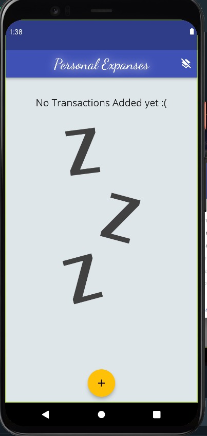
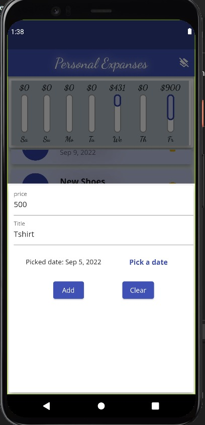
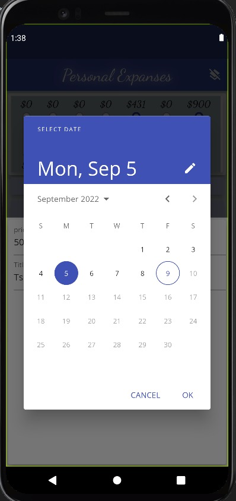
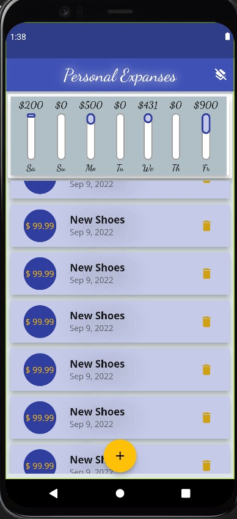
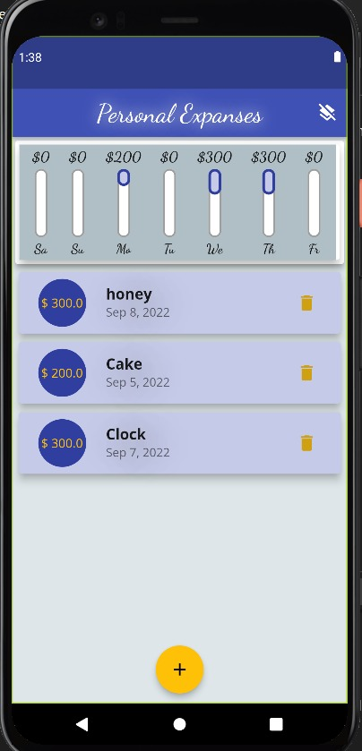

# **Presonal Expenses Tracker**

# Table of content
* About the project 
  * built with
* Getting Started 
  * installation
  * Running
* ScreenShots

# About
 This is a simple mobile application which calculates the person expenses during each week by adding items or deleting them and tracks up where he spend his money through a bar charts which represents the percentage he spent on each day from the total of one week!

## Built with
* Flutter
* Dart 

# Getting Started 
> The following instructions are your guide to setup the project on your device and try it.

## installation 
1. __Clone the repo__
   >$git clone https://github.com/abdelazizSalah/presonal_expenses
2. __Navigate to repo directory__
   >cd personal_expanses
3. __Install dependencies__ 
   1. Android Studio
   2. Flutter 
   3. Dart  
4. **Make sure that flutter is working properly**
   1. > flutter doctor
5. __Run the Program__
   1. >flutter run

## Running 
* **run the main.dart file**

# ScreenShots
 ### **Empty Transactions**
* 
 -------
 ### **Adding new item**
* 
 -------
 ### **Picking a Date**
* 
 -------
 ### **Scrolling The Page**
* 
 -------
 ### **The Chart with some expanses**
* 
 -------

